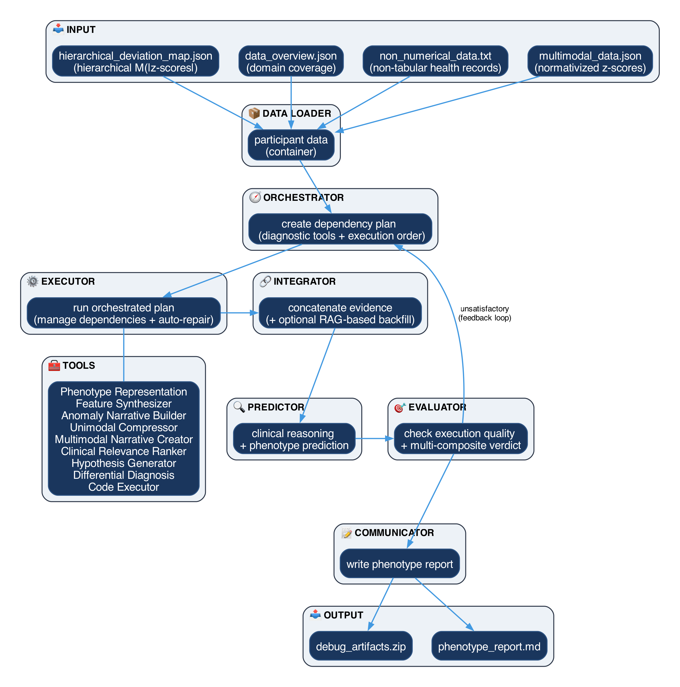

# Clinical Ontology-driven Multi-modal Predictive Agentic Support System (COMPASS)

<!--
<div align="center">
  
</div>
-->

**COMPASS** is an advanced multi-agent orchestrator for deep phenotype prediction, integrating hierarchical multi-modal deviation maps and non-tabular health information. The current engine supports binary classification, multiclass classification, univariate regression, multivariate regression, and hierarchical mixed task trees.

## 🚀 Key Features

- **Multi-Agent Orchestration**: A dynamic actor-critic team of specialized agents (**Orchestrator, Executor, Integrator, Predictor, Critic**) collaborates to synthesize complex diagnostic logic through iterative refinement cycles.
- **Scalable Nature of LLM-based Knowledge**: Leverages the vast pre-trained clinical and biomedical knowledge of state-of-the-art large language models (LLM) for high-precision phenotypic prediction without requiring task-specific training, or fine-tuning.
- **Explainable Clinical Reasoning**: Generates multi-modal evidence chains using diverse XAI methods, transforming complex high-dimensional data signals into human-interpretable narratives.
- **Live Dashboard**: Integrated real-time UI for monitoring agent reasoning, token usage, and cross-modal evidence synthesis as it happens.
- **Deep Phenotyping Report**: A dedicated **Communicator** agent produces a `deep_phenotype.md` report that is evidence-grounded and explicit about missing data (no hallucinated metrics).


## 🧠 System Architecture

COMPASS utilizes a sequential multi-agent workflow with iterative feedback loops.

<div align="center">
  
</div>

## 🖥️ Interactive Dashboard

COMPASS features a real-time monitoring dashboard that provides full transparency into the multi-agent reasoning process.

<div align="center">
  
</div>

Through the dashboard, you can:
- **Monitor Live Execution**: Track agent progress, elapsed time, and token consumption in real-time.
- **Inspect Execution Plans**: View the dynamic plans generated by the Orchestrator for each iteration.
- **Analyze Reasoning**: Deep-dive into the clinical narratives and cross-modal evidence chains as they are synthesized.
- **Audit System Logs**: Access structured execution logs for full traceability of all agent decisions and tool calls.

## 🛠️ Installation

1. **Clone the repository**:
   ```bash
   git clone https://github.com/stvsever/COMPASS-Engine.git
   cd COMPASS-Engine
   ```

2. **Install dependencies**:
   ```bash
   pip install -r requirements.txt
   ```

3. **Configure Environment**:
   Create a `.env` file with your API keys:
   ```env
   OPENROUTER_API_KEY=sk-...
   ```

## ⚡ Usage

### Quick Start (CLI)
Run the pipeline on a participant folder ('binary classification' by default):

```bash
python main.py data/pseudo_data/inputs/SUBJ_001_PSEUDO \
  --prediction_type binary \
  --target_label target_phenotype \
  --control_label non_target_comparator \
  --backend openrouter
```

Examples of other supported prediction tasks:

```bash
# Multiclass
python main.py data/pseudo_data/inputs/SUBJ_001_PSEUDO \
  --prediction_type multiclass \
  --target_label phenotype_subtype \
  --class_labels subtype_a,subtype_b,subtype_c

# Univariate regression
python main.py data/pseudo_data/inputs/SUBJ_001_PSEUDO \
  --prediction_type regression_univariate \
  --target_label total_score \
  --regression_output total_score

# Multivariate regression
python main.py data/pseudo_data/inputs/SUBJ_001_PSEUDO \
  --prediction_type regression_multivariate \
  --target_label trait_profile \
  --regression_outputs openness,conscientiousness,extraversion,agreeableness,neuroticism

# Hierarchical mixed tree
python main.py data/pseudo_data/inputs/SUBJ_001_PSEUDO \
  --prediction_type hierarchical \
  --task_spec_file /path/to/task_spec.json
```

Use `--regression_output` for univariate regression (single output) and `--regression_outputs` for multivariate regression (comma-separated list).

### Explainability CLI (Backend-only)
Run explainability methods on the selected final attempt:

```bash
python main.py data/pseudo_data/inputs/SUBJ_001_PSEUDO \
  --prediction_type binary \
  --target_label target_phenotype \
  --control_label non_target_comparator \
  --backend openrouter \
  --xai_methods external,internal,hybrid
```

Important: XAI currently supports only pure root-level binary classification. For multiclass/regression/hierarchical tasks, XAI is skipped with explicit status metadata.

Each participant folder must contain four core input files (see data/pseudo_data/inputs):
```text
- data_overview.json
- hierarchical_deviation_map.json
- multi_modal_data.json
- non_numerical_data.txt
```
The first three JSON files are ontology-based structured feature maps created during pre-processing

Pipeline outputs (per participant) include:
```text
- report_{participant_id}.md        (standard clinical report)
- deep_phenotype.md                 (communicator deep phenotyping report, generated manually via UI or --generate_deep_phenotype)
- execution_log_{participant_id}.json (structured execution log + dataflow summary/assertions)
```

Backend notes:
- `Public API (OpenRouter)` is the default in UI/CLI.
- Local runs can be configured in the Advanced Configuration panel (engine, dtype, quantization, context window, and role-specific overrides).

### Docker (CPU/UI)

For a clean containerized UI/API workflow, see:

- `docker/README.md`

Short usage:

```bash
tar --exclude-from=docker/.dockerignore -cf - . | docker buildx build --platform linux/arm64 -f docker/Dockerfile -t compass-ui:local --load -
export OPENROUTER_API_KEY="<your_openrouter_api_key>"
docker run --rm -p 5005:5005 --name compass-ui -e OPENROUTER_API_KEY="${OPENROUTER_API_KEY}" compass-ui:local
```

For Intel Mac/Linux/Windows builds, use `--platform linux/amd64` (see `docker/README.md` for the full matrix and troubleshooting).

> [!NOTE]
> Optional variant: includes local-inference deps (`torch`/`transformers`/`bitsandbytes`) for people who really want them.
> GPU acceleration is explicitly not here; use `hpc/`.

### HPC Example (Single GPU Setup)

For a complete Slurm + Apptainer workflow example for single-GPU HPC execution, see:

- `hpc/README.md`
- `hpc/HPC_Operational_Guide.ipynb`

This includes step-by-step setup, single-participant validation, sequential batch execution scripts, and a didactic HPC notebook.

> [!NOTE]
> **Batch Configuration**
> Step 05 supports multi-disorder balanced cohorts via `DISORDER_GROUPS` and `PER_GROUP_SIZE` environment variables.
> Results, including confusion matrices and detailed analysis, are saved to the `results/` directory.

### Clinical Validation with Annotated Datasets

If your cohort includes ground-truth annotations, COMPASS provides validation tooling for binary, multiclass, regression, and hierarchical analyses.

```bash
# Run analysis manually after a batch completes:
python utils/validation/with_annotated_dataset/compute_confusion_matrix.py \
    --results_dir ../results/participant_runs \
    --targets_file ../data/__TARGETS__/cases_controls_with_specific_subtypes.txt \
    --output_dir ../results/analysis/binary_confusion_matrix \
    --disorder_groups "MAJOR_DEPRESSIVE_DISORDER,ANXIETY_DISORDERS"

python utils/validation/with_annotated_dataset/detailed_analysis.py \
    --results_dir ../results/participant_runs \
    --targets_file ../data/__TARGETS__/cases_controls_with_specific_subtypes.txt \
    --output_dir ../results/analysis/details \
    --disorder_groups "MAJOR_DEPRESSIVE_DISORDER,ANXIETY_DISORDERS"
```

For a detailed walkthrough, see `utils/validation/with_annotated_dataset/validation_guide.ipynb`.

### Notebook on General Usage 

For a general hands-on walkthrough on how to use the COMPASS-engine, run the included Jupyter Notebook:

```bash
jupyter notebook COMPASS_demo.ipynb
```

The notebook includes separate backend controls for:
- Public API mode (OpenRouter model + context window)
- Local backend mode (model path/name + local runtime settings)

## 📁 Project Structure

```text
multi_agent_system/
├── agents/             # Autonomous agent definitions (Orchestrator, Predictor, Critic, etc.) and prompts
├── tools/              # Clinical analysis tools (COMPASS Core Tools) and prompt templates
├── frontend/           # Interactive Web UI (Flask backend + HTML/CSS/JS frontend)
├── docker/             # Containerized UI/API runtime and optional full-dependency variant
├── hpc/                # Slurm + Apptainer scripts and HPC operational notebook
├── utils/              # System utilities (Core Engine, Logging, Embeddings, Logic)
├── data/               # Data package
│   ├── models/         # Pydantic data models & execution plan schemas
│   └── pseudo_data/    # Synthetic clinical data for demonstration
├── config/             # Environment & system-wide settings
└── main.py             # CLI Entry Point
```

## 🎓 Project Context

This Multi-Agent System is being developed in the context of a **Master's Internship in Theoretical and Experimental Psychology (with Specialization in Neuroscience)** at **Ghent University** (Belgium).

The research is being conducted at the **Computational Neuroimaging Lab** of **[IIS Biobizkaia](https://compneurobilbao.eus)** (Bilbao, Spain).

COMPASS is being developed and tested on large multimodal phenotype cohorts to evaluate robustness, scalability, and generalization in real-world population settings.

## 📚 Project Credits

**Author**: Stijn Van Severen (email: stijn.vanseveren@ugent.be)

**Supervisors**: 
- **Ibai Díez Palacio** (Computational Neuroimaging Lab @ IIS Biobizkaia & Dept. of Radiology related to Harvard Medical School)
- **Jesús M. Cortés** (Computational Neuroimaging Lab @ IIS Biobizkaia)

**Research Lab**: [Computational Neuroimaging Lab](https://compneurobilbao.eus)

## 📝 Internship Blogpost

As part of the internship dissemination, a Dutch blogpost was created and is available on GitHub Pages:

**Blogpost**: https://stvsever.github.io/COMPASS-Engine/

## 🛡️ License

This project is licensed under the GNU General Public License v3.0 ; see the [LICENSE](LICENSE) file for details.

## 📈 Future Work

Key future development directions include:
- **Continuous Engine Optimization & Stability Refinement**  
  COMPASS is currently an active research prototype under rapid development. While the core architecture is functional, intermittent edge-case inconsistencies and overall suboptimal performance may arise. 
  
  We are continuously refining the multi-agent logic to enhance system-wide robustness and predictable behavioral stability.

- **Improved Frontend & Clinical Usability**  
  Ongoing work focuses on expanding the interactive dashboard into a more user-friendly clinical frontend, simplifying workflow monitoring, interpretation, and report exploration.

- **Dedicated DataLoader Agent for Raw Multi-Modal Preparation**  
  A major next step is the implementation of a specialized **Data Loader Agent** that automatically prepares raw neuroimaging, deviation-map, and electronic health inputs into a standardized `ParticipantData` container, ensuring seamless delivery to the **Orchestrator Agent** and reducing manual preprocessing overhead.

Together, these developments aim to strengthen the COMPASS-engine as a scalable, interpretable, and clinician-oriented framework for next-generation deep phenotyping and decision support.

> [!CAUTION]
> **EU MDR / PRE-CLINICAL DISCLAIMER**
> COMPASS is a **Clinical Decision Support System (CDSS) prototype** designed for research purposes only. It is **NOT** a certified medical device under the EU Medical Device Regulation (MDR 2017/745) or FDA guidelines. Do not use for primary diagnostic decisions. All outputs must be verified by a qualified clinician.
