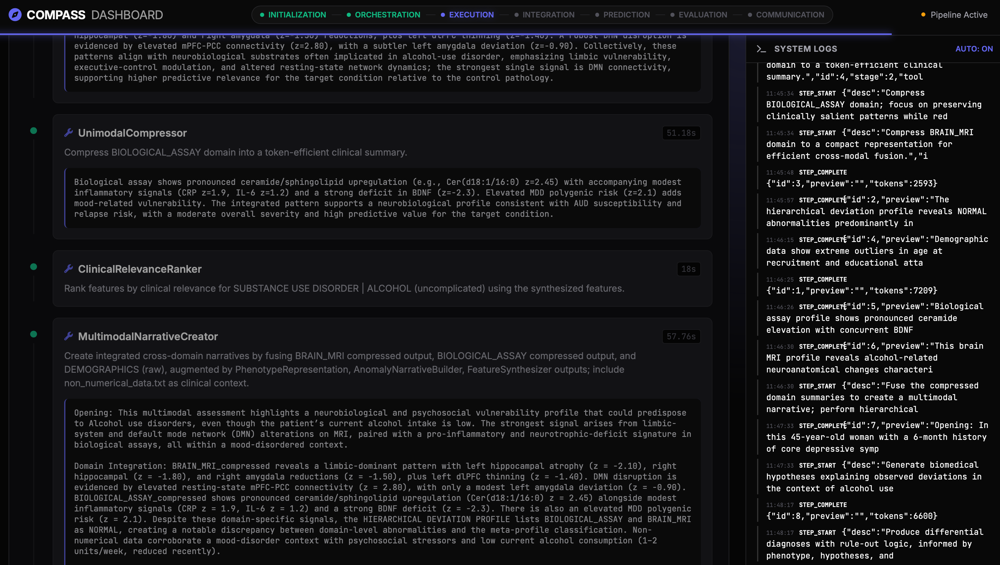

# COMPASS: Clinical Orchestrated Multi-modal Predictive Agentic Support System

<!--
<div align="center">
  
</div>
-->

**COMPASS** is an advanced multi-agent orchestrator for clinical decision support, enabling precise phenotypic prediction by integrating (hierarchical) multi-modal deviation maps and non-tabular electronic health information. Our current system is customized for neuropsychiatric phenotyping with data from the UK Biobank ; developed as part of an internship project @ IIS BioBizkaia.

## 🚀 Key Features

- **Multi-Agent Orchestration**: A dynamic actor-critic team of specialized agents (**Orchestrator, Executor, Integrator, Predictor, Critic**) collaborates to synthesize complex diagnostic logic through iterative refinement cycles.
- **Scalable Nature of LLM-based Knowledge**: Leverages the vast pre-trained clinical and biomedical knowledge of state-of-the-art large language models (LLM) for high-precision phenotypic prediction without requiring task-specific training, or fine-tuning.
- **Zero-Shot Scalability**: Architected to scale across thousands of multi-modal features and diverse clinical phenotypes by utilizing LLMs as flexible, data-aware reasoning engines.
- **Semantic RAG Fusion**: Employs a "Smart Fusion" layer that prioritizes semantically relevant biomarkers using hierarchical embeddings and targeted context retrieval to maximize the information-to-token ratio.
- **Explainable Clinical Reasoning**: Generates multi-modal evidence chains and structured patient reports, transforming complex high-dimensional data signals into human-interpretable clinical narratives.
- **Live Dashboard**: Integrated real-time UI for monitoring agent reasoning, token usage, and cross-modal evidence synthesis as it happens.


## 🧠 System Architecture

COMPASS utilizes a sequential multi-agent workflow with iterative feedback loops.

<div align="center">
  
</div>
<br>

## 🖥️ Interactive Dashboard

COMPASS features a real-time monitoring dashboard that provides full transparency into the multi-agent reasoning process.

<div align="center">
  
</div>

Through the dashboard, you can:
- **Monitor Live Execution**: Track agent progress, elapsed time, and token consumption in real-time.
- **Inspect Execution Plans**: View the dynamic plans generated by the Orchestrator for each iteration.
- **Analyze Reasoning**: Deep-dive into the clinical narratives and cross-modal evidence chains as they are synthesized.
- **Audit System Logs**: Access structured execution logs for full traceability of all agent decisions and tool calls.

## 🛠️ Installation

1. **Clone the repository**:
   ```bash
   git clone https://github.com/IIS-Biobizkaia/COMPASS.git
   cd COMPASS
   ```

2. **Install dependencies**:
   ```bash
   pip install -r requirements.txt
   ```

3. **Configure Environment**:
   Create a `.env` file with your API keys:
   ```env
   OPENAI_API_KEY=sk-...
   ```

## ⚡ Usage

### Quick Start (CLI)
Run the pipeline on a participant folder:

```bash
python main.py data/pseudo_data/SUBJ_001_PSEUDO --target "Major Depressive Disorder" --backend local
```

Each participant folder must contain four core input files (see data/pseudo_data/):
```text
- data_overview.json
- hierarchical_deviation_map.json
- multimodal_data.json
- non_numerical_data.txt
```
The first three JSON files are ontology-based structured feature maps created during pre-processing

> [!NOTE]
> **Batch Configuration**
> The participant list and specific target conditions are defined within `batch_run.py`. 
> Results, including Confusion Matrices and detailed logs, are saved to the `results/` directory.

For a hands-on walkthrough, run the included Jupyter Notebook:

```bash
jupyter notebook COMPASS_demo.ipynb
```

## 📁 Project Structure

```text
multi_agent_system/
├── agents/             # Autonomous agent definitions (Orchestrator, Predictor, Critic, etc.) and prompts
├── tools/              # Clinical analysis tools (COMPASS Core Tools) and prompt templates
├── frontend/           # Interactive Web UI (FastAPI backend + JavaScript/CSS frontend)
├── utils/              # System utilities (Core Engine, Logging, Embeddings, Logic)
├── data/               # Data package
│   ├── models/         # Pydantic data models & execution plan schemas
│   └── pseudo_data/    # Synthetic clinical data for validation
├── config/             # Environment & system-wide settings
└── main.py             # CLI Entry Point
```

## 🎓 Project Context

This Multi-Agent System is being) developed in the context of a **Master's Internship in Theoretical and Experimental Psychology (Neuroscience)** at **Ghent University** (Belgium).

The research was conducted at the **Computational Neuroscience Lab** of **[IIS Biobizkaia](https://compneurobilbao.eus)** (Bilbao, Spain).

**Author**: Stijn Van Severen
**Supervisors**: 
*   **Ibai Díez Palacio** (omputational Neuroimaging Lab @ IIS Biobizkaia & Dept. of Radiology; Harvard Medical School)
*   **Jesús M. Cortés** (Computational Neuroimaging Lab @ IIS Biobizkaia)

**Lab**: [Computational Neuroscience Group](https://compneurobilbao.eus)

COMPASS is currently being tested on a large neuropsychiatric cohort from the **UK Biobank**, leveraging available multi-modal brain and clinical data to evaluate robustness, scalability, and generalization in real-world population settings.

## 🛡️ License

This project is licensed under the MIT License ; see the [LICENSE](LICENSE) file for details.

## 📈 Future Work

Key future development directions include:
- **Continuous Engine Optimization & Stability Refinement**  
  COMPASS is currently an active research prototype under rapid development. While the core architecture is functional, intermittent edge-case inconsistencies may arise. We are continuously refining the multi-agent logic to enhance system-wide robustness and predictable behavioral stability.

- **Automated Explainability of Token-Driven Predictions**  
  We are developing an integrated evaluation layer to automatically quantify which **feature-based token sets** most strongly drive each clinical prediction (e.g., TokenSHAP-style methods, Integrated Gradients, LLM-select attribution, etc.) 

  This builds directly on prior work in *Hierarchical TokenSHAP-style attribution* (see: https://github.com/stvsever/aHFR_TokenSHAP), enabling transparent post-hoc interpretability across hierarchical feature spaces.
  
- **Improved Frontend & Clinical Usability**  
  Ongoing work focuses on expanding the interactive dashboard into a more user-friendly clinical frontend, simplifying workflow monitoring, interpretation, and report exploration.

- **Dedicated DataLoader Agent for Raw Multi-Modal Preparation**  
  A major next step is the implementation of a specialized **Data Loader Agent** that automatically prepares raw neuroimaging, deviation-map, and electronic health inputs into a standardized `ParticipantData` container, ensuring seamless delivery to the **Orchestrator Agent** and reducing manual preprocessing overhead.

Together, these developments aim to strengthen COMPASS as a scalable, interpretable, and clinician-oriented framework for next-generation neuropsychiatric phenotyping and decision support.

> [!CAUTION]
> **EU MDR / PRE-CLINICAL DISCLAIMER**
> COMPASS is a **Clinical Decision Support System (CDSS) prototype** designed for research purposes only. It is **NOT** a certified medical device under the EU Medical Device Regulation (MDR 2017/745) or FDA guidelines. Do not use for primary diagnostic decisions. All outputs must be verified by a qualified clinician.
