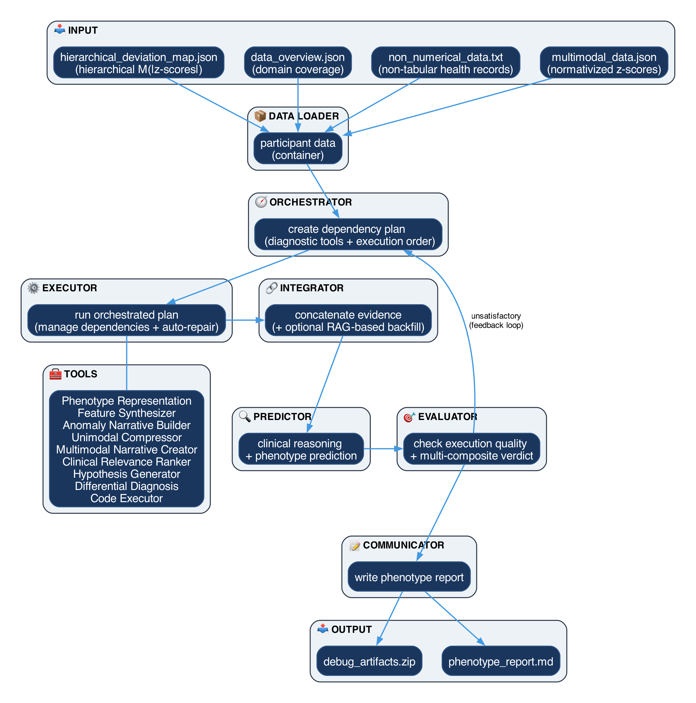
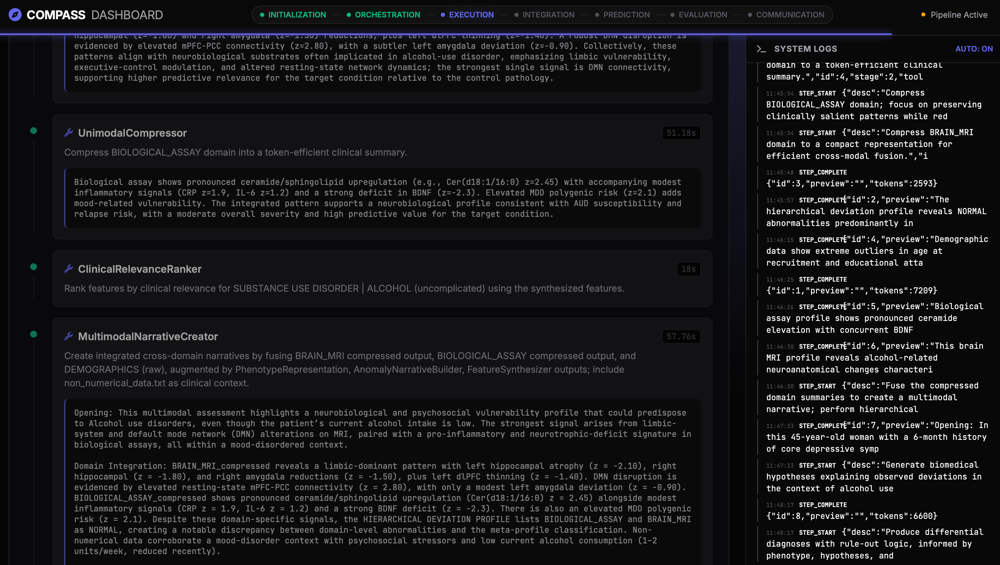
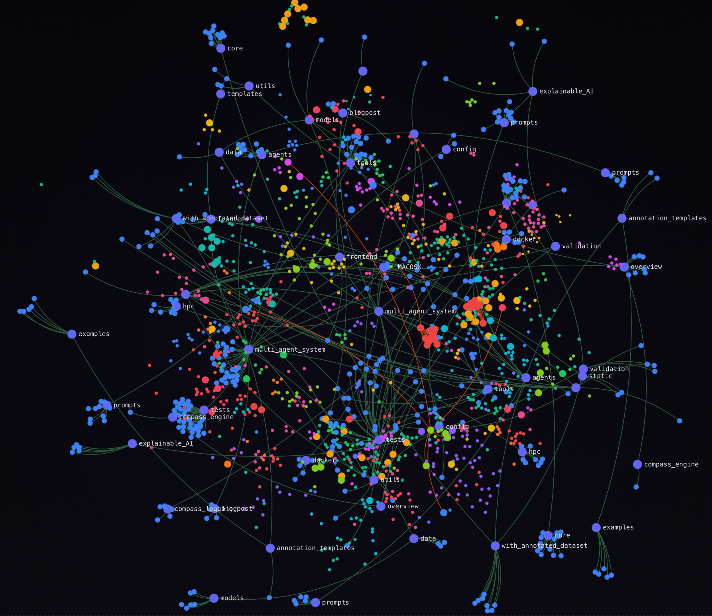

<div align="center">

# Clinical Ontology-driven Multi-modal Predictive Agentic Support System (COMPASS)

<!--
  
-->

[](#)
[](https://www.gnu.org/licenses/gpl-3.0)
[](https://www.python.org/)
[](docker/)
<br>

**COMPASS** is an advanced multi-agent orchestrator for deep phenotype prediction, integrating hierarchical multi-modal deviation maps and non-tabular health information. The current engine supports binary classification, multiclass classification, univariate regression, multivariate regression, and hierarchical mixed task trees.

</div>

---

## 📖 Table of Contents

- [🚀 Key Features](#key-features)
- [🧠 System Architecture](#system-architecture)
- [🖥️ Interactive Dashboard](#interactive-dashboard)
- [🛠️ Installation](#installation)
- [⚡ Usage](#usage)
- [📁 Project Structure](#project-structure)
- [🎓 Project Context](#project-context)
- [📚 Project Credits](#project-credits)
- [📝 Internship Blogpost](#internship-blogpost)
- [📄 Research Paper](#research-paper)
- [📈 Future Work](#future-work)

<br>

## <a id="key-features"></a>🚀 Key Features

- **Multi-Agent Orchestration**: A dynamic actor-critic team of specialized agents (**Orchestrator, Executor, Integrator, Predictor, Critic**) collaborates to synthesize complex diagnostic logic through iterative refinement cycles.
- **Scalable Nature of LLM-based Knowledge**: Leverages the vast pre-trained clinical and biomedical knowledge of state-of-the-art large language models (LLM) for high-precision phenotypic prediction without requiring task-specific training, or fine-tuning.
- **Explainable Clinical Reasoning**: Generates multi-modal evidence chains using diverse XAI methods, transforming complex high-dimensional data signals into human-interpretable narratives.
- **Live Dashboard**: Integrated real-time UI for monitoring agent reasoning, token usage, and cross-modal evidence synthesis as it happens.
- **Deep Phenotyping Report**: A dedicated **Communicator** agent produces a `deep_phenotype.md` report that is evidence-grounded and explicit about missing data (no hallucinated metrics).


## <a id="system-architecture"></a>🧠 System Architecture

The COMPASS-engine utilizes a sequential multi-agent workflow with iterative feedback loops.

<div align="center">
  
</div>

## <a id="interactive-dashboard"></a>🖥️ Interactive Dashboard

COMPASS features a real-time monitoring dashboard that provides full transparency into the multi-agent reasoning process.

<div align="center">
  
</div>

Through the dashboard, you can:
- **Monitor Live Execution**: Track agent progress, elapsed time, and token consumption in real-time.
- **Inspect Execution Plans**: View the dynamic plans generated by the Orchestrator for each iteration.
- **Analyze Reasoning**: Deep-dive into the clinical narratives and cross-modal evidence chains as they are synthesized.
- **Audit System Logs**: Access structured execution logs for full traceability of all agent decisions and tool calls.

## <a id="installation"></a>🛠️ Installation

### Docker (CPU/UI)

For a clean containerized UI/API workflow, see:

- `docker/README.md`

Short usage:

```bash
tar --exclude-from=docker/.dockerignore -cf - . | docker buildx build --platform linux/arm64 -f docker/Dockerfile -t compass-ui:local --load -
export OPENROUTER_API_KEY="<your_openrouter_api_key>"
docker run --rm -p 5005:5005 --name compass-ui -e OPENROUTER_API_KEY="${OPENROUTER_API_KEY}" compass-ui:local
```

For Intel Mac/Linux/Windows builds, use `--platform linux/amd64` (see `docker/README.md` for the full matrix and troubleshooting).

> [!NOTE]
> Optional variant: includes local-inference deps (`torch`/`transformers`/`bitsandbytes`) for people who really want them.
> GPU acceleration is explicitly not here; use `hpc/`.


## <a id="usage"></a>⚡ Usage

### Expected Input-Output Structure

Each participant folder must contain four core input files (see data/pseudo_data/inputs):
```text
- data_overview.json
- hierarchical_deviation_map.json
- multi_modal_data.json
- non_numerical_data.txt
```
The first three JSON files are ontology-based structured feature maps created during pre-processing

Pipeline outputs (per participant) include:
```text
- report_{participant_id}.md        (standard clinical report)
- deep_phenotype.md                 (communicator deep phenotyping report, generated manually via UI or --generate_deep_phenotype)
- execution_log_{participant_id}.json (structured execution log + dataflow summary/assertions)
```

Backend notes:
- `Public API (OpenRouter)` is the default in UI/CLI.
- Local runs can be configured in the Advanced Configuration panel (engine, dtype, quantization, context window, and role-specific overrides).

### Quick Start (CLI)
Run the pipeline on a participant folder ('binary classification' by default):

```bash
python main.py data/pseudo_data/inputs/SUBJ_001_PSEUDO \
  --prediction_type binary \
  --target_label target_phenotype \
  --control_label non_target_comparator \
  --backend openrouter
```

Examples of other supported prediction tasks:

```bash
# Multiclass
python main.py data/pseudo_data/inputs/SUBJ_001_PSEUDO \
  --prediction_type multiclass \
  --target_label phenotype_subtype \
  --class_labels subtype_a,subtype_b,subtype_c

# Univariate regression
python main.py data/pseudo_data/inputs/SUBJ_001_PSEUDO \
  --prediction_type regression_univariate \
  --target_label total_score \
  --regression_output total_score

# Multivariate regression
python main.py data/pseudo_data/inputs/SUBJ_001_PSEUDO \
  --prediction_type regression_multivariate \
  --target_label phenotype_profile \
  --regression_outputs phenotype_p1,phenotype_p2,phenotype_p3

# Hierarchical mixed tree
python main.py data/pseudo_data/inputs/SUBJ_001_PSEUDO \
  --prediction_type hierarchical \
  --task_spec_file /path/to/task_spec.json
```

### HPC Example (Single GPU Setup)

For a complete Slurm + Apptainer workflow example for single-GPU HPC execution, see:

- `hpc/README.md`
- `hpc/HPC_Operational_Guide.ipynb`

This includes step-by-step setup, single-participant validation, sequential batch execution scripts, and a didactic HPC notebook.

> [!NOTE]
> **Batch Configuration**
> Step 05 supports multi-disorder balanced cohorts via `DISORDER_GROUPS` and `PER_GROUP_SIZE` environment variables.
> Results, including confusion matrices and detailed analysis, are saved to the `results/` directory.

### Explainability CLI (Backend-only)
Run explainability methods on the selected final attempt:

```bash
python main.py data/pseudo_data/inputs/SUBJ_001_PSEUDO \
  --prediction_type binary \
  --target_label target_phenotype \
  --control_label non_target_comparator \
  --backend openrouter \
  --xai_methods external,internal,hybrid
```

Important: XAI currently supports only pure root-level binary classification. For multiclass/regression/hierarchical tasks, XAI is skipped with explicit status metadata.

### Clinical Validation with Annotated Datasets

If your cohort includes ground-truth annotations, COMPASS provides validation tooling for binary, multiclass, regression, and hierarchical analyses.

For binary validation, `--targets_file` must be JSON (`binary_targets.json` style).

```bash
# Binary classification (targets file)
python utils/validation/with_annotated_dataset/run_validation_metrics.py \
    --results_dir ../results/participant_runs \
    --prediction_type binary \
    --targets_file ../data/__TARGETS__/binary_targets.json \
    --output_dir ../results/analysis/binary_confusion_matrix \
    --disorder_groups "MAJOR_DEPRESSIVE_DISORDER,ANXIETY_DISORDERS"

python utils/validation/with_annotated_dataset/detailed_analysis.py \
    --results_dir ../results/participant_runs \
    --prediction_type binary \
    --targets_file ../data/__TARGETS__/binary_targets.json \
    --output_dir ../results/analysis/details \
    --disorder_groups "MAJOR_DEPRESSIVE_DISORDER,ANXIETY_DISORDERS"
```

See notebook `[validation_guide.ipynb](utils%2Fvalidation%2Fwith_annotated_dataset%2Fvalidation_guide.ipynb) for a complete walkthrough of the automated validation process with annotations, including for multi-class, uni-/multi-variate regression and hierarchical/mixed prediction tasks.
### Notebook on General Usage 

For a general hands-on walkthrough on how to use the COMPASS-engine, run the included Jupyter Notebook:

```bash
jupyter notebook COMPASS_demo.ipynb
```

The notebook includes separate backend controls for:
- Public API mode (OpenRouter model + context window)
- Local backend mode (model path/name + local runtime settings)

## <a id="project-structure"></a>📁 Project Structure

A client-side graph creator (GitNexus) was used to generate  a comprehensive knowledge graph of the entire codebase; its component interactions are provided below:

<div align="center">
  
</div>

The main root folders are listed below, with a brief description of their contents. 

```text
multi_agent_system/
├── agents/             # Autonomous agent definitions (Orchestrator, Predictor, Critic, etc.) and prompts
├── tools/              # Clinical analysis tools (COMPASS Core Tools) and prompt templates
├── frontend/           # Interactive Web UI (Flask backend + HTML/CSS/JS frontend)
├── docker/             # Containerized UI/API runtime and optional full-dependency variant
├── hpc/                # Slurm + Apptainer scripts and HPC operational notebook
├── utils/              # System utilities (Core Engine, Logging, Embeddings, Logic)
├── data/               # Data package
│   ├── models/         # Pydantic data models & execution plan schemas
│   └── pseudo_data/    # Synthetic clinical data for demonstration
├── config/             # Environment & system-wide settings
└── main.py             # CLI Entry Point
```

## <a id="project-context"></a>🎓 Project Context

This Multi-Agent System is being developed in the context of a **Master's Internship in Theoretical and Experimental Psychology (with Specialization in Neuroscience)** at **Ghent University** (Belgium).

The research is being conducted at the **Computational Neuroimaging Lab** of **[IIS Biobizkaia](https://compneurobilbao.eus)** (Bilbao, Spain).

COMPASS is being developed and tested on large multimodal phenotype cohorts to evaluate robustness, scalability, and generalization in real-world population settings.

## <a id="project-credits"></a>📚 Project Credits

**Author**: Stijn Van Severen (email: stijn.vanseveren@ugent.be) [1]

**Supervisors**: 
- **Ibai P. Díez** [2,3,5]
- **Jesús M. Cortés** [2,3,4]

**Affiliations**:
1. Department of Experimental Psychology, Ghent University, Ghent, Belgium  
2. Computational Neuroimaging Lab, Biobizkaia Health Research Institute, Barakaldo, Spain  
3. IKERBASQUE: The Basque Foundation for Science, Bilbao, Spain  
4. Department of Cell Biology and Histology, University of the Basque Country, Leioa, Spain  
5. Center for Inflammation Imaging, Mass General Brigham, Harvard Medical School, Boston, MA, USA  

**Research Lab**: [Computational Neuroimaging Lab](https://compneurobilbao.eus)

Van Severen, S., Díez, I. P., & Cortés, J. M. (2026). *Leveraging Pre-Trained Knowledge of Large Language Models: Toward a Scalable Multi-Modal Approach for Deep Phenotypic Prediction of Neuropsychiatric Disorders.* [Manuscript in preparation]

## <a id="internship-blogpost"></a>📝 Internship Blogpost

As part of the internship dissemination, a Dutch blogpost was created and is available on GitHub Pages:

**Blogpost**: https://stvsever.github.io/COMPASS-Engine/

## <a id="research-paper"></a>📄 Research Paper

As the first clinical validation study of this architecture, we evaluated the system's binary classification performance on the UK Biobank dataset. For a comprehensive overview of the methodology and findings, please refer to the full **[Internship Report](research/internship_report/main1.pdf)**.

> *On a 200-participant UK Biobank benchmark spanning five disorder families, COMPASS achieved an aggregate accuracy of 0.725 (95% Wilson CI: 0.659–0.782), with balanced sensitivity (0.730) and specificity (0.720).*

The 14B AWQ-based multi-agent system defines the reported accuracy as a conservative lower bound for the architecture’s potential.

## <a id="future-work"></a>📈 Future Work

Key future development directions include:
- **Continuous Engine Optimization & Stability Refinement**  
  COMPASS is currently an active research prototype under rapid development. While the core architecture is functional, intermittent edge-case inconsistencies and overall suboptimal performance may arise. 
  
  We are continuously refining the multi-agent logic to enhance system-wide robustness and predictable behavioral stability.

- **Improved Frontend & Clinical Usability**  
  Ongoing work focuses on expanding the interactive dashboard into a more user-friendly clinical frontend, simplifying workflow monitoring, interpretation, and report exploration.

- **Dedicated DataLoader Agent for Raw Multi-Modal Preparation**  
  A major next step is the implementation of a specialized **Data Loader Agent** that automatically prepares raw neuroimaging, deviation-map, and electronic health inputs into a standardized `ParticipantData` container, ensuring seamless delivery to the **Orchestrator Agent** and reducing manual preprocessing overhead.

- **Multi-Cohort and Larger-Scale External Validation**  
  Additional validation studies are planned to evaluate the system's generalizability on external cohorts beyond the UK Biobank. By leveraging diverse open resources (e.g., Human Connectome Project, NKI-Rockland Sample) and larger population studies (e.g., ABCD Study, Generation Scotland), we aim to stress-test the architecture's transportability across different age ranges, ancestry structures, and acquisition pipelines.

Together, these developments aim to strengthen the COMPASS-engine as a scalable, interpretable, and clinician-oriented framework for next-generation deep phenotyping and decision support.

> [!CAUTION]
> **EU MDR / PRE-CLINICAL DISCLAIMER**
> COMPASS is a **Clinical Decision Support System (CDSS) prototype** designed for research purposes only. It is **NOT** a certified medical device under the EU Medical Device Regulation (MDR 2017/745) or FDA guidelines. Do not use for primary diagnostic decisions. All outputs must be verified by a qualified clinician.
